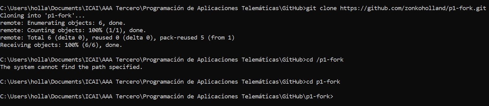
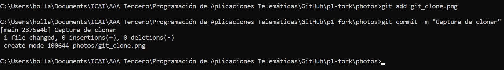

# Práctica 1

Un repositorio para empezar a usar [git](https://git-scm.com/) y Github

## ¿Como probar en la nube?

[Github-Codespaces](https://github.com/features/codespaces)

## Comandos git básicos

```
git clone https://github.com/gitt-3-pat/p1
git status
git add .
git commit -m "TU MENSAJE"
git push

git checkout -b feature/1
git checkout main
```

## ¿Cómo escribir un README.md con formato?

[Github Markdown](https://docs.github.com/es/get-started/writing-on-github/getting-started-with-writing-and-formatting-on-github/basic-writing-and-formatting-syntax)

# Práctica 1 - Marco Holland

## git clone

Clonado del repositorio p1-fork a local:



## git add; git commit

Se utilizan estos comandos para añadir y hacer `commit` de la captura previa:



## git checkout

Este comando (junto con el prefijo -b) se utiliza para crear una nueva rama, el cuál se va a usar para almacenar los documentos:

```
C:\Users\holla\Documents\ICAI\AAA Tercero\Programación de Aplicaciones Telemáticas\GitHub\p1-fork>git checkout -b documentos
Switched to a new branch 'documentos'

C:\Users\holla\Documents\ICAI\AAA Tercero\Programación de Aplicaciones Telemáticas\GitHub\p1-fork>git branch
* documentos
  main
```

 


